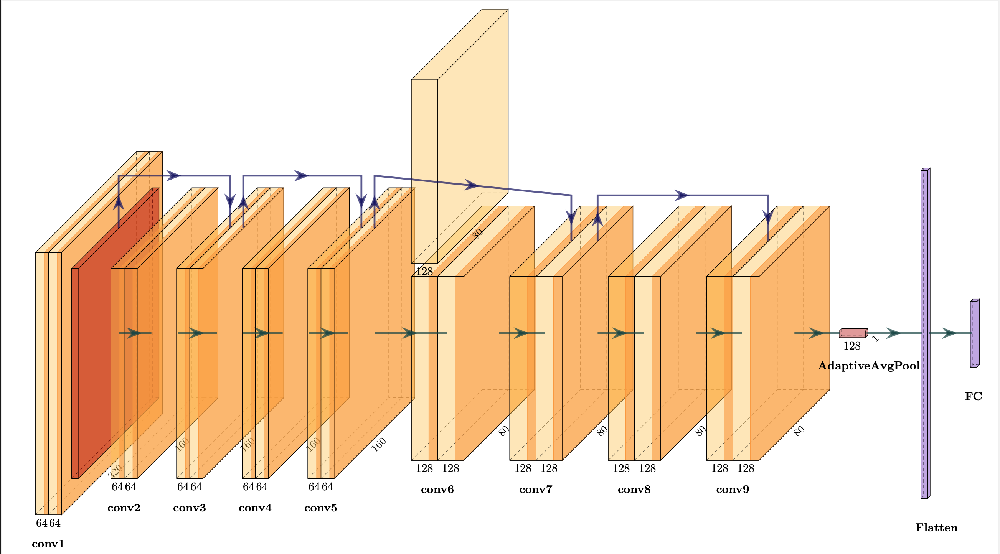

# Markdown教程

# 1 Markdown 标题


Markdown 标题有两种格式。

在每一行末尾打两个空格然后回车下一行继续写就可以在显示的时候自动换行了。

### 使用 = 和 - 标记一级和二级标题

= 和 - 标记语法格式如下：

```
我展示的是一级标题
=================

我展示的是二级标题
-----------------
```

### 使用 # 号标记

使用 **#** 号可表示 1-6 级标题，一级标题对应一个 **#** 号，二级标题对应两个 **#** 号，以此类推。

```
# 一级标题
## 二级标题
### 三级标题
#### 四级标题
##### 五级标题
###### 六级标题
```

最多六个标题 效果图如下

# 一级标题
## 二级标题
### 三级标题
#### 四级标题
##### 五级标题

###### 六级标题


# 2 Markdown 字体形式

Markdown 可以使用以下几种字体：

```
*斜体文本*
_斜体文本_
**粗体文本**
__粗体文本__
***粗斜体文本***
___粗斜体文本___
```

*斜体文本*
_斜体文本_
**粗体文本**
__粗体文本__
***粗斜体文本***
___粗斜体文本___


## 分隔线

你可以在一行中用三个以上的星号、减号、底线来建立一个分隔线，行内不能有其他东西。你也可以在星号或是减号中间插入空格。下面每种写法都可以建立分隔线：

```
***

* * *

*****

- - -

----------
```


***

* * *

*****

- - -

----------

## 删除线

如果段落上的文字要添加删除线，只需要在文字的两端加上两个波浪线 **~~** 即可，实例如下：

```
RUNOOB.COM
GOOGLE.COM
~~BAIDU.COM~~
```


RUNOOB.COM
GOOGLE.COM
~~BAIDU.COM~~

## 下划线

下划线可以通过 HTML 的 **<u>** 标签来实现：

```
<u>带下划线文本</u>
```

<u>带下划线文本</u>

## 脚注

脚注是对文本的补充说明。在文章结尾显示 也可以是文献的引用。

Markdown 脚注的格式如下:

```
[^要注明的文本]
```

```
创建脚注格式类似这样 [^RUNOOB]。

[^RUNOOB]: f饭饭爱吃饭！！！
```

创建脚注格式类似这样 [^RUNOOB]。

[^RUNOOB]: 饭饭爱吃饭！！！


## 标签凸块

``` 
英文输入法下 ``
`饭饭`
```

`饭饭`

# 3 Markdown 区块

Markdown 区块引用是在段落开头使用 **>** 符号 ，然后后面紧跟一个**空格**符号：

```
> 饭饭
> 减减爱吃饭
> 饭饭好邪恶😈
```

> 饭饭
> 减减爱吃饭
> 饭饭好邪恶😈

另外区块是可以嵌套的，一个 **>** 符号是最外层，两个 **>** 符号是第一层嵌套，以此类推：

```
> 最外层
> > 第一层嵌套
> > > 第二层嵌套
```

> 最外层
> > 第一层嵌套
> >
> > > 第二层嵌套

### 区块中使用列表

区块中使用列表实例如下： 

```
> 区块中使用列表
> 1. 第一项
> 2. 第二项
> + 第一项
> + 第二项
> + 第三项
```

> 区块中使用列表
> 1. 第一项
> 2. 第二项
> + 第一项
> + 第二项
> + 第三项


### 列表中使用区块

如果要在列表项目内放进区块，那么就需要在 **>** 前添加四个空格的缩进。

列表中使用区块实例如下：

```
* 第一项
    > 菜鸟教程
    > 学的不仅是技术更是梦想
* 第二项
```

* 第一项
    > 菜鸟教程
    > 学的不仅是技术更是梦想
* 第二项


# 4 Markdown 代码

如果是段落上的一个函数或片段的代码可以用反引号把它包起来（**`**），例如：

```
`printf()` 函数
```

`printf()` 函数

### 代码区块

代码区块使用 **4 个空格**或者一个**制表符（Tab 键）**。

你也可以用 **```** 空格后包裹一段代码，并指定一种语言（也可以不指定）：

````
``` python
import troch
from torch.nn import nn
```
````

``` python
import troch
from torch.nn import nn
```

# 5 Markdown 链接

链接使用方法如下：

```
[链接名称](链接地址)

或者

<链接地址>
```

```
这是一个[B站链接](https://space.bilibili.com/313576911)
```

这是一个[B站链接](https://space.bilibili.com/313576911)

直接使用链接地址：

```
<https://space.bilibili.com/313576911>
```

<https://space.bilibili.com/313576911>

## 链接到本地

[图片](./1.png)

### 高级链接

我们可以通过变量来设置一个链接，变量赋值在文档末尾进行：

```
这个链接用 1 作为网址变量 [Google][1]
这个链接用 runoob 作为网址变量 [Runoob][runoob]
然后在文档的结尾为变量赋值（网址）

  [1]: http://www.google.com/
  [runoob]: http://www.runoob.com/
```

这个链接用 1 作为网址变量 [Google][1]
这个链接用 runoob 作为网址变量 [Runoob][runoob]
然后在文档的结尾为变量赋值（网址）

[1]: http://www.google.com/
[runoob]: https://www.bilibili.com/?spm_id_from=333.999.b_696e7465726e6174696f6e616c486561646572.1


# 6 Markdown 图片

Markdown 图片语法格式如下：

```


```

- 开头一个感叹号 !
- 接着一个方括号，里面放上图片的替代文字
- 接着一个普通括号，里面放上图片的网址，最后还可以用引号包住并加上选择性的 'title' 属性的文字。

使用实例：

```



```


Markdown 还没有办法指定图片的高度与宽度，如果你需要的话，你可以使用普通的 ` `标签。

```

```


# 7 Markdown 表格

Markdown 制作表格使用 **|** 来分隔不同的单元格，使用 **-** 来分隔表头和其他行。

语法格式如下：

```
|  表头   | 表头  |
|  ----  | ----  |
| 单元格  | 单元格 |
| 单元格  | 单元格 |
```


对齐方式

**我们可以设置表格的对齐方式：**

- **-:** 设置内容和标题栏居右对齐。
- **:-** 设置内容和标题栏居左对齐。
- **:-:** 设置内容和标题栏居中对齐。

实例如下：

```
| 左对齐 | 右对齐 | 居中对齐 |
| :-----| ----: | :----: |
| 单元格 | 单元格 | 单元格 |
| 单元格 | 单元格 | 单元格 |
```

| 左对齐 | 右对齐 | 居中对齐 |
| :----- | -----: | :------: |
| 单元格 | 单元格 |  单元格  |
| 单元格 | 单元格 |  单元格  |


# 8 Markdown 高级技巧


### 支持的 HTML 元素

不在 Markdown 涵盖范围之内的标签，都可以直接在文档里面用 HTML 撰写。

目前支持的 HTML 元素有：`<kbd> <b> <i> <em> <sup> <sub> <br>`等 ，如：

```
使用 <kbd>Ctrl</kbd>+<kbd>Alt</kbd>+<kbd>Del</kbd> 重启电脑
```

使用 <kbd>Ctrl</kbd>+<kbd>Alt</kbd>+<kbd>Del</kbd> 重启电脑

### 转义

Markdown 使用了很多特殊符号来表示特定的意义，如果需要显示特定的符号则需要使用转义字符，Markdown 使用反斜杠转义特殊字符：

```
**文本加粗** 
\*\* 正常显示星号 \*\*
```

**文本加粗** 
\*\* 正常显示星号 \*\*


### 公式

当你需要在编辑器中插入数学公式时，可以使用两个美元符 $$ 包裹 TeX 或 LaTeX 格式的数学公式来实现。提交后，问答和文章页会根据需要加载 Mathjax 对数学公式进行渲染。如：

```
$$
\mathbf{V}_1 \times \mathbf{V}_2 =  \begin{vmatrix} 
\mathbf{i} & \mathbf{j} & \mathbf{k} \\
\frac{\partial X}{\partial u} &  \frac{\partial Y}{\partial u} & 0 \\
\frac{\partial X}{\partial v} &  \frac{\partial Y}{\partial v} & 0 \\
\end{vmatrix}
${$tep1}{\style{visibility:hidden}{(x+1)(x+1)}}
$$
```

$$
\mathbf{V}_1 \times \mathbf{V}_2 =  \begin{vmatrix} 
\mathbf{i} & \mathbf{j} & \mathbf{k} \\
\frac{\partial X}{\partial u} &  \frac{\partial Y}{\partial u} & 0 \\
\frac{\partial X}{\partial v} &  \frac{\partial Y}{\partial v} & 0 \\
\end{vmatrix}
${$tep1}{\style{visibility:hidden}{(x+1)(x+1)}}
$$

### 公式实时编译

为了触发行内内嵌数学符号的实时编译你需要：输入$然后按下ESC键之后输入TeX命令，之后就会弹出一个如图所示的工具提示栏

$\tau = a +b$

### 下标

想要使用这个功能，需要在设置面板的 Markdown 栏启动它，之后使用~来修饰下标文本。栗如：

```
H~2~O 和X~long\ text~
```


H~2~O 和X~long\ text~

### 上标

想要使用这个功能，需要在设置面板的 Markdown 栏启动它，之后使用^来修饰下标文本。栗如：

```
X^2^ 
```


X^2^ 

## 代办列表

代办列表 语法：减号加空格加 [ 加空格 ]空格加文字

```
- [ ] 减减
- [ ] 饭饭
- [ ] 饭饭好邪恶😈
- [x] 减减好邪恶😈
```


- [ ] 减减
- [ ] 饭饭
- [ ] 饭饭好邪恶😈
- [x] 减减好邪恶😈
